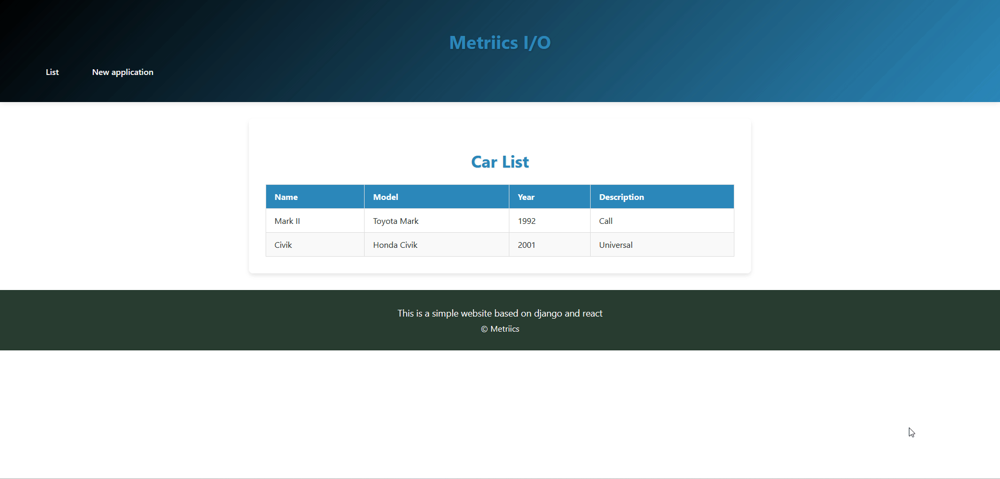

# djangoReactApp

# CRMProzdorovie

![React](https://img.shields.io/badge/React-61DAFB?style=flat&logo=react&

## About

CRM Prozdorovie is a customized Customer Relationship Management system developed specifically for the Prozdorovie clinic to enhance the efficiency of the company’s managers. The system streamlines client management, sales workflows, and marketing automation. Key features include contact management, sales funnel tracking, automated marketing campaigns, and detailed analytics — all aimed at improving customer engagement and optimizing business performance.

## Database Structure

Below is the diagram of the database structure used in CRMProzdorovie:

   

